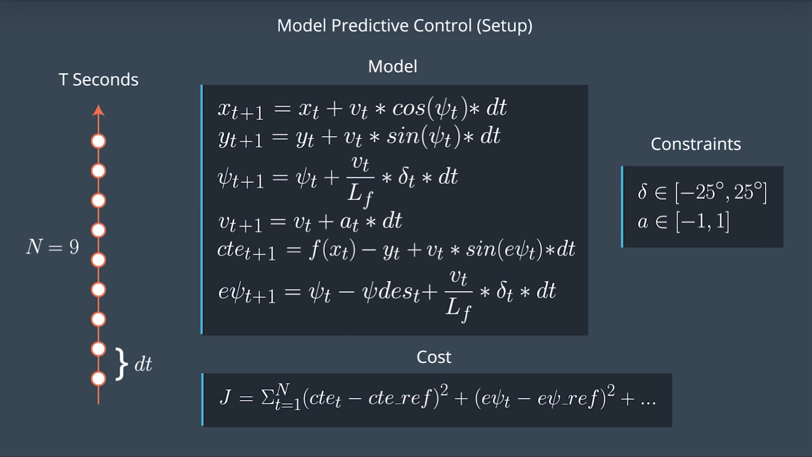
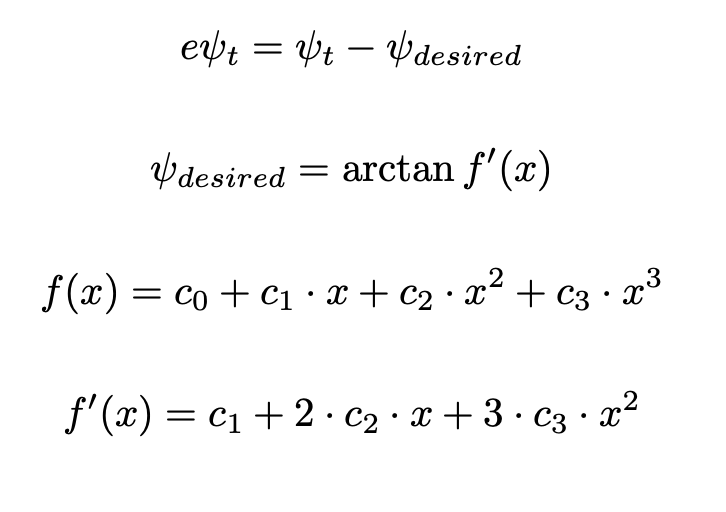
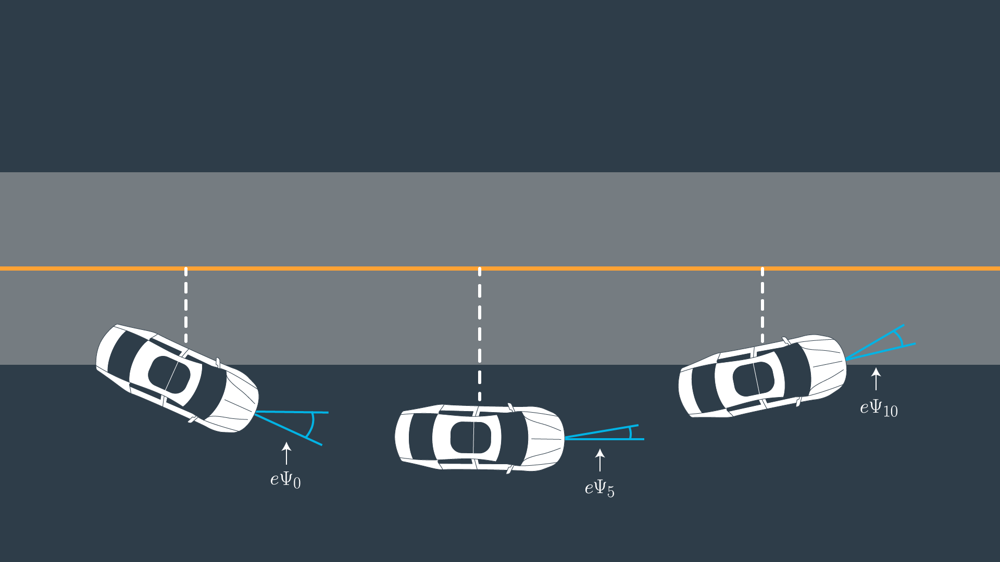
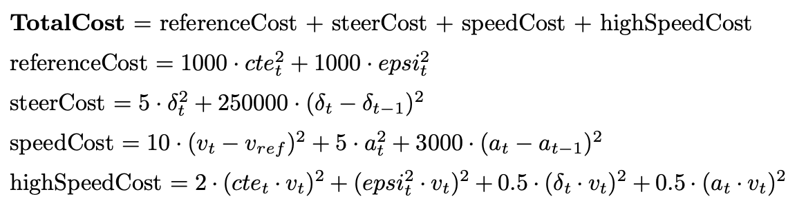
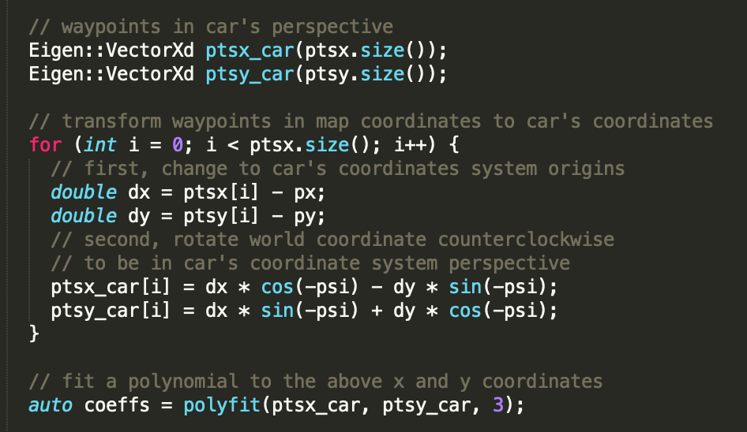

# Model Predictive Controller

[](http://www.udacity.com/drive)

## Overview

In this project, I'll implement a Model Predictive Controller (MPC) in C++ to control the vehicle, so it can successfully drive around tracks without leaving the road.

Specifically, this project is a revisit of both the [Behavioral Cloning](https://goo.gl/6njxcy) and [PID controller](https://goo.gl/VFo99v) project. 

## Project Demo


You can also watch a demo video of this project [on my YouTube](https://youtu.be/eFOjyHG1WUQ). 

Alternatively, if you want to watch the results of my [Behavioral Cloning Project](https://goo.gl/6njxcy), you can watch a simulation video for the [same Lake Track](https://youtu.be/bJPQDfu15sc), or the [more challenging Jungle Track](https://youtu.be/eu2-NLfhzYQ). You can also watch the results of my [PID controller](https://goo.gl/VFo99v) project for the [same Lake Track](https://youtu.be/poxOXTRucyQ).

**Visual Markers**
- Yellow lines are reference trajectory.
- Green lines are predicted/planned trajectory by the car

## Get the Code

You can download this folder of code [here](https://tugan0329.bitbucket.io/downloads/udacity/car/mpc/p10-model-predictive-controller.zip)


## Project Setup

This project involves the Simulator which can be downloaded [here](https://github.com/udacity/self-driving-car-sim/releases)


This repository includes two bash files (`install-mac.sh` and `install-ubuntu.sh`) under the `setup` fodler that can be used to set up and install [uWebSocketIO](https://github.com/uWebSockets/uWebSockets) for either Linux or Mac systems. 

For windows you can use either Docker, VMware, or even [Windows 10 Bash on Ubuntu](https://www.howtogeek.com/249966/how-to-install-and-use-the-linux-bash-shell-on-windows-10/) to install uWebSocketIO. 

You also need `Ipopt`, `Fortran`, and `CppAD` for this project, where you can find more [installation instructions](setup/README.md) in the `setup` folder.

## Run the Project


Once the install for uWebSocketIO is complete, the main program can be built and ran by doing the following from the project top directory.

```
1. mkdir build
2. cd build
3. cmake ..
4. make
5. ./mpc
```

Then, you can open the [Simulator you downloaded](https://github.com/udacity/self-driving-car-sim/releases) and choose "Project 5" to run the project.


## Implementation Details

### Model & Cost Function

The main idea of a model predictive controller is to model the behaviors of a car as closely as possible in order to control the car for a desired goal, which is in term accomplished by minimizing a predefined loss function.

To keep the model simple and intuitive, I decided to omit many complex mechanics and physics, such as: tire forces, longitudinal and lateral forces, inertia, gravity, air resistance, drag, mass, and the geometry of the vehicle, etc.

The final model I used is an abstraction of the motion state of a car, by encapsulating its `x` coordinate, `y` coordinate, orientation `psi`, velocity `v`, steering angle `delta`, and its acceleration `a`. 

I also calculate and keep track of the cross track error `cte` and the  error `epsi` between the desired car orientation `psi_{desired}` (which depends on the road and the curvature etc.) and the actual car orientation `psi`.

Mathematically, these state variables and their corresponding update equations with respect to time can be defined as follows:



To calculate the orientation error and the desired orientation `psi_{desired}`, we recall 



Specifically, we can see why the desired orientation is `arctan(f'(x))` from below:



To model the cost, I designed the cost function with respect to the context of this task: to drive a car **smoothly** around a lake track **without leaving** the road. 



Specifically, the total cost incurred is made of four separate costs:

- _reference cost_: the cost incurred because the car is not in a state consistent with the ideal, desired state. This includes the cross track error and the error of the car orientation, compared to the ideal car orientation
- _steer cost_: the cost for steering the car too drastically or change the steering angles too much in between the timestamps. This cost is the main contributor to ensure the car **drives smoothly**. It incurs a huge penalty when the model makes huge changes on the steering angle from time to time, so it prevents wheel oscillation on the road and make the car turn and drive smoothly. Specifically, I also capped the maximum steering angle to reside between positive and negative 20 degrees, to ensure even smoother turn.
- _speed cost_: the cost of car velocity and speed change. To make car drive at a relatively constant speed, we penalize if the velocity of the car is off from the desired velocity `v_{ref}`, so the car won't drive too slow or too fast due to acceleration throttles. We also penalize on acceleration and the change in accelerations, so we won't speed up or down the car too quickly, and even have sudden stops.
- _high speed cost_: this is an additional term I designed to slow down the car when we have a really high cost, high acceleration, or large steering angle. The rationale is that when we are speeding up quickly, or turning drastically, or way too off the road, we want to drive slower so we can adjust smoothly and correctly. Otherwise, a large velocity may make the car adjust at an insane angel and rate, usually leading the car to drive off track.

### Timestep Length, Elapsed Duration (N & dt), Latency

The model predictive controller attempts to approximate a continuous reference trajectory by means of discrete paths between actuations, so it needs to predict into the future based on the motion model of the car.

Specifically, the prediction horizon is the duration `T` over which future predictions are made, where the duration `T` depends on the number of timesteps `N` in the horizon and how much time elapses during actuations `dt`. Larger values of `dt` result in less frequent actuations, which makes it harder to accurately approximate a continuous reference trajectory. This is sometimes called "discretization error".

In my implementation, I decided to predict one second into the future, because the car is driving, potentially really fast, so it's a good idea to constantly reevaluate the state of the car and makes new prediction, as one second is already long enough for the car to drive for quite a fair amount of distance. _However_, the model predictive controller has a latency of 100ms, which means that the car won't take the action by MPC until 100ms (0.1 second) later. Thus, I first chose my timestamp `dt` to be `0.1` second (=100ms), and I also initially set my cost function use `t-2` as the previous timestamp, instead of `t-1`, to take into account the latency. This choice of `dt` nicely works out and solves two problems at the same time.

Later, as suggested my my code reviewer, this approach to take latency into account isn't ideal as the latency simulation kicks in only after the first value which is what we really interested about. Thus, I moved to another approach where I use the future state of vehicle, after the 100ms latency, when solving for the accentuations, so my accentuation calculations are more accurate.  


Our `T` is 1 second and `dt` is `0.1`, so our `N` naturally becomes `T/dt = 10`, which is my final choice of `N`. It also turns out to be a common choice of `N`, `dt` parameters.
 
I also have tried increasing the number of timestamps and decreasing the `dt` to even `0.01`, but when the `dt` is too small, the car wheels oscillate a lot and too rapidly, making the car drive non-smoothly and off track. This is due to we are evaluating our predictions too quickly. When I increase `dt` to larger values, then the latency kicks in to affect the vehicle and it becomes harder to also turn at sharp angles on the road.

### Polynomial Fitting and MPC Preprocessing

We need the waypoints to fit the polynomial desired. However, the coordinates sent by the simulator are in the world/map coordinates. In MPC preprocessing, we are working in car's coordinate frame, where the direction of the car is the x axis, and the left side of the car is the y axis. Therefore, a change of coordinate is needed in order to preprocess all the waypoints and fit the polynomials. 

Changing the waypoints from the map coordinate to car coordinates system is the easiest to do, as we then don't have to alter much about the existing variables for the vehicle state and actuators. 

The direction of the car is also the orientation `psi` of the car in the world coordinate system, so by rotating the map x axis to the car orientation, we transformed the map x axis to the car x axis. The y axis and z axis follows straight forwardly. This rotation is simple, and it's just applying a counterclockwise rotate by `psi` for all the waypoints. The origin of the map coordinate also needs to be transformed and shifted to the origin of the car's coordinate system, which is easily done by just moving the map origin to the center of the car `(x, y)`. Now, we get our desired coordinate transform! 

In code, it is like this:




